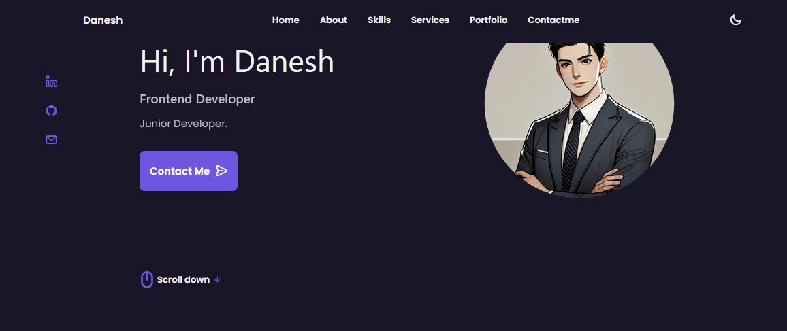
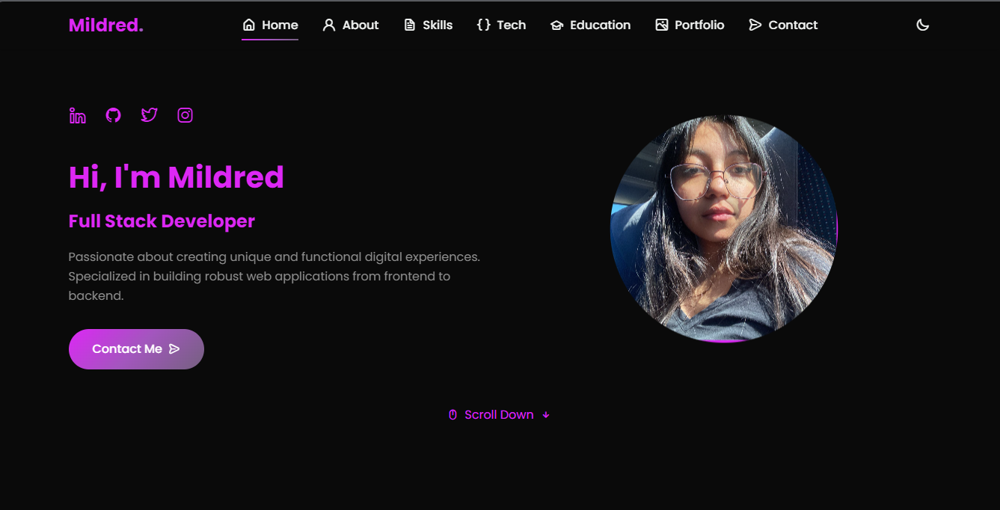
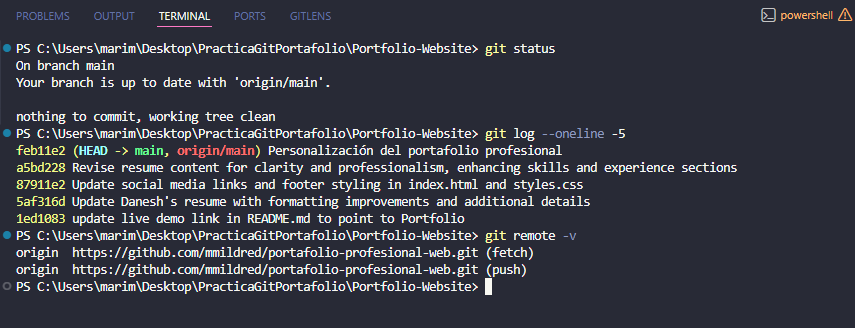

  
  
  
  

    
    
    
  

---

## 📋 Tabla de Contenidos
- [📌 Objetivo de la práctica](#-objetivo-de-la-práctica)
- [👩‍💻 Nombre del estudiante](#-nombre-del-estudiante)
- [🎨 Tecnologías utilizadas](#-tecnologías-utilizadas)
- [✨ Cambios realizados](#-cambios-realizados)
- [💻 Comandos Git utilizados](#-comandos-git-utilizados)
- [📸 Evidencias](#-evidencias)
- [🔗 Enlaces de interés](#-enlaces-de-interés)

---

## 📌 Objetivo de la práctica
> **Personalizar una plantilla web profesional utilizando Git y GitHub**

Aprender a clonar, modificar y desplegar un sitio web personalizado aplicando conceptos fundamentales de control de versiones y desarrollo frontend.

---

## 👩‍💻 Nombre del estudiante

  
  ### 🌸 Mildred Mariana Banda López 🌸
  
  *"Full Stack Developer | Creative Problem Solver | Tech Enthusiast"*
  

---

## 🎨 Tecnologías utilizadas

  
  | Tecnología | Uso |
  |------------|-----|
  | **HTML5** | Estructura del sitio |
  | **CSS3** | Estilos y diseño responsivo |
  | **JavaScript** | Interactividad y animaciones |
  | **Git** | Control de versiones |
  | **GitHub** | Repositorio remoto |
  

---

## ✨ Cambios realizados

  
  ### 🎯 Personalización completa del portafolio
  

| Área | Cambio realizado | Estado |
|------|------------------|--------|
| **Información personal** | Actualización de nombre, profesión (Full Stack Developer) y descripción | ✅ Completado |
| **Colores y estilos** | Implementación de paleta personalizada | ✅ Completado |
| **Fotografía profesional** | Inclusión de foto personal en el avatar y sección "About" | ✅ Completado |
| **Sección de Habilidades** | Frontend y Backend con porcentajes y barras de progreso | ✅ Completado |
| **Tecnologías dominadas** | Nueva sección con íconos y tecnologías | ✅ Completado |
| **Experiencia académica** | Sección de educación con tarjetas interactivas | ✅ Completado |
| **Proyectos destacados** | Enlaces a 3 repositorios de GitHub con tecnologías destacadas | ✅ Completado |
| **Redes sociales** | Enlaces a LinkedIn, GitHub, Twitter e Instagram | ✅ Completado |
| **Diseño responsivo** | Adaptación para móvil, tablet y escritorio | ✅ Completado |
| **Modo oscuro/claro** | Implementación de tema dinámico con localStorage | ✅ Completado |
| **Animaciones** | Efectos hover, floating, typewriter y scroll reveal | ✅ Completado |

---

## 💻 Comandos Git utilizados

| Comando | Descripción |
|---------|-------------|
| `git clone` | Clonar repositorio remoto |
| `git status` | Ver estado de archivos modificados |
| `git add .` | Preparar todos los archivos para commit |
| `git commit -m "mensaje"` | Guardar cambios localmente |
| `git push` | Subir cambios al repositorio remoto |
| `git pull` | Descargar cambios del repositorio remoto |
| `git branch` | Listar/crear ramas |
| `git checkout` | Cambiar entre ramas |
| `git merge` | Fusionar ramas |
| `git remote -v` | Ver repositorios remotos configurados |

  
  **Flujo de trabajo implementado:**
  
  `git clone` → `git checkout -b develop` → `git add .` → `git commit -m "mensaje"` → `git push origin develop` → `git checkout main` → `git merge develop` → `git push`
  

---

## 📸 Evidencias

### 🏠 Sitio Original

*Plantilla original antes de la personalización*

### ✨ Sitio Personalizado

*Portafolio profesional completamente personalizado*

### 💻 Vista Móvil (Responsive)

*Diseño adaptado para dispositivos móviles*

### 🖥️ Vista Tablet

*Diseño responsivo en tablet*

### ⌨️ Comandos en terminal

*Ejecución de comandos Git en terminal*

### 🌓 Modo Oscuro/Claro

*Tema oscuro implementado con toggle button*

---

## 🔗 Enlaces de interés

| Recurso | Enlace |
|---------|--------|
| 🌐 **Sitio web desplegado** | [Ver portafolio en vivo](https://mmildred.github.io/portafolio-profesional-web/) |
| 📁 **Repositorio GitHub** | [Ir al repositorio](https://github.com/mmildred/portafolio-profesional-web) |
| 📄 **Mi CV profesional** | [Descargar CV](./assets/PDF/Mildred_CV.pdf) |

---

## 📊 Estadísticas del proyecto

| Métrica | Valor |
|---------|-------|
| 📁 Archivos modificados | 5 |
| 💾 Commits realizados | 12+ |
| 🔀 Ramas utilizadas | 2 (main, develop) |
| 🎨 Líneas de CSS | 800+ |
| 📝 Líneas de HTML | 600+ |
| ⚡ Líneas de JavaScript | 200+ |
| 🖼️ Imágenes agregadas | 8 |
| 📱 Dispositivos compatibles | 3 (móvil, tablet, escritorio) |

---

  
  

  
  ### 🚀 Desarrollado con ❤️ por Mildred Mariana Banda López
  
  *"La tecnología es mejor cuando une a las personas"*
  
  

    <a href="https://github.com/mmildred">GitHub</a> •
    <a href="https://www.linkedin.com/in/mildredbanda">LinkedIn</a> •
    <a href="mailto:mildred09b@gmail.com">Email</a>
  

  
  ***© 2026 - Todos los derechos reservados***
  

